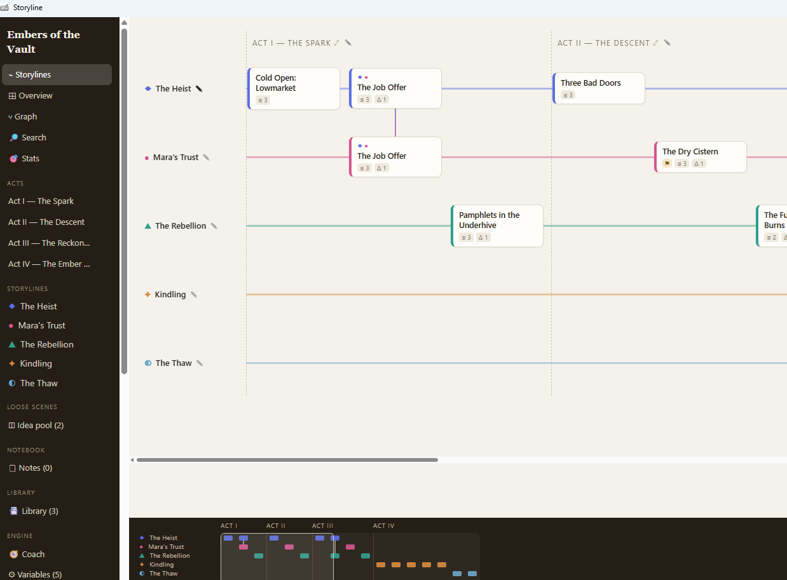
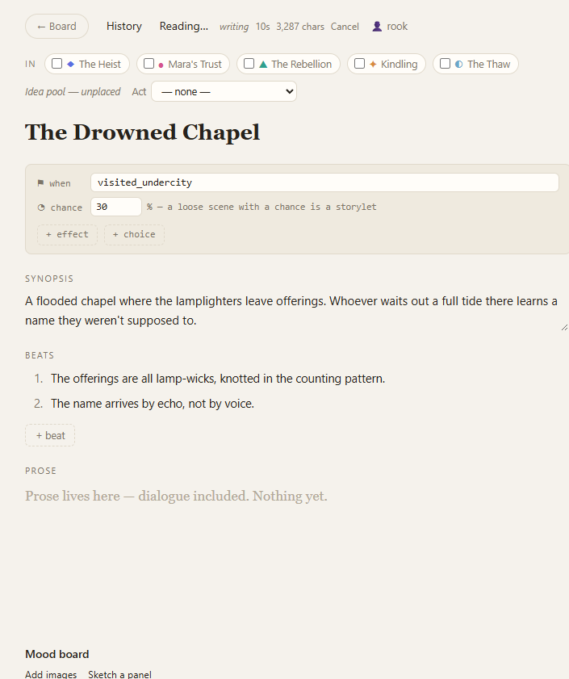
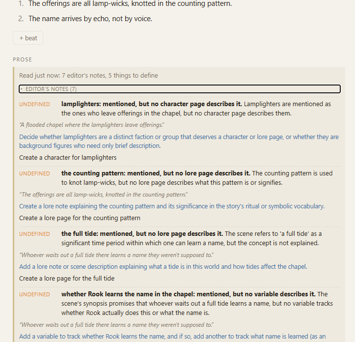
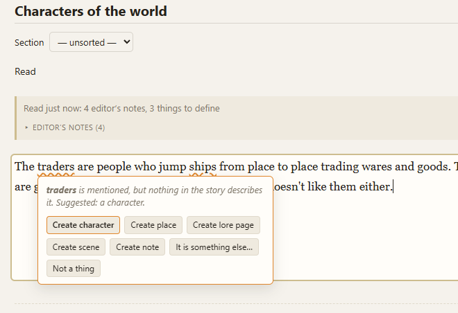
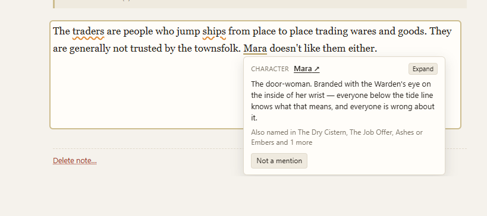

# Story Boarder


A local-first app for writing a video game's story — structure, prose, characters, world, and a declarative conditions engine — stored as plain md files.
> This was primarily built by Claude and it smells and tastes like it unfortunately. I've done my best to play through the tool and adjust wording so it sounds less gross. The utility of the tool has been great and accomplished my primary goal which was for someone whos new to organizing storylines to dive into a tool with little experience and have an enjoyable time putting pen to paper. 



## Motivation

DevOps, Software Development, to me, is a creative process. There are always problems to solve and folks in these domains need to come up with creative solutions. I wanted to test creativity in another form - story telling. After doing research I came upon this concept of storyboard based authoring which seemed like an excellent way to organize thoughts and connect logic in ways that made sense from an author's perspective and not an engineer. This solution is rough around the edges but it works for me and I like it. It combines features from various storyboarding platforms that I liked. Please enjoy - royalty free yay!

## Installing

I do not have a publishing/code-signing key for this package and so you will face the unknown installer warning.

Every release has a `SHA256SUMS.txt` next to the installer. Hash your download and compare:

```
certutil -hashfile "Story.Boarder_<version>_x64-setup.exe" SHA256
```

The workflow also has GitHub attest the build. If you have the GitHub CLI
```
gh attestation verify "Story.Boarder_<version>_x64-setup.exe" --repo patricksimonian/story-boarder
```

## Running it

```
pnpm install
pnpm dev
```

Target browsers are Edge and Chrome on Windows 11 — the app leans on the File System Access API, which is Chromium-only.

`pnpm test` runs the vitest suite, `pnpm build` typechecks and bundles, `pnpm lint` runs oxlint.

## Building

Web build to `dist/`:

```
pnpm build
```

Desktop build (Windows): needs Rust (`winget install Rustlang.Rustup`), the Visual Studio C++ build tools, and the WebView2 runtime.

```
pnpm desktop          # dev window with hot reload
pnpm desktop:build    # installer → src-tauri/target/release/bundle/nsis/
pnpm test:rust        # shell tests
```

Icon: edit `src-tauri/icons/source.png` (square), run `pnpm tauri icon src-tauri/icons/source.png`, then touch `src-tauri/build.rs` before building so the exe picks it up.

### Releasing

```
pnpm changeset fixed "The coach accepts a five-field run again."
pnpm release:notes     # what the next release would say
```

To release, run the `release` workflow under Actions on `main` and type the version, `eg 0.2.0`.


## Coach Claude

I wanted a feature that acted like your personal editor. Introducing Coach Claude. Coach Claude wires to your existing claude subscription by spawning a `claude -p` shell. If you are adverse to this, do not turn it on. Reasonable safe gaurds have been put in place to protect your environment from an unleashed claude LLM call, as well as to prevent inadvertant execution through the spawn. This feature is optional and disabled by default.

What does the coach do?
- Reads entire scenes and story lines
- Can be activated to read any form of prose content
- Sanity checks your work:
  - finds potential loopholes
  - characters that are not defined
  - missing variables
  - potential issues with continuity

Here it is in action






### Evals for the coach

The reads are a model's judgement. `pnpm eval:coach` runs the real reads, through your own Claude Code, against the fixtures under `evals/` with stated expectations. The evals are built around the above sanity checks that I had mentioned. I hope in future releases to expand the evals and to offer more customization to prevent excessive token usage. Running evals and the coach spends your usage
